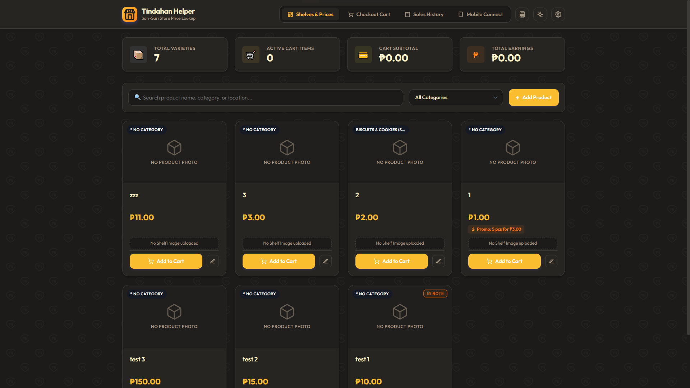
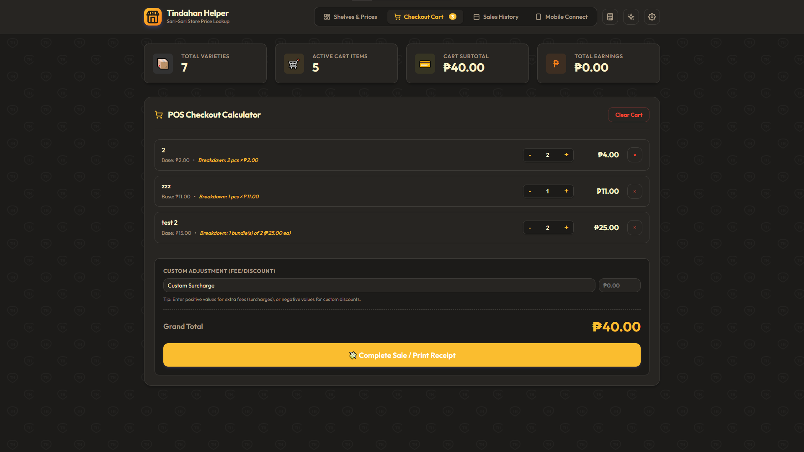
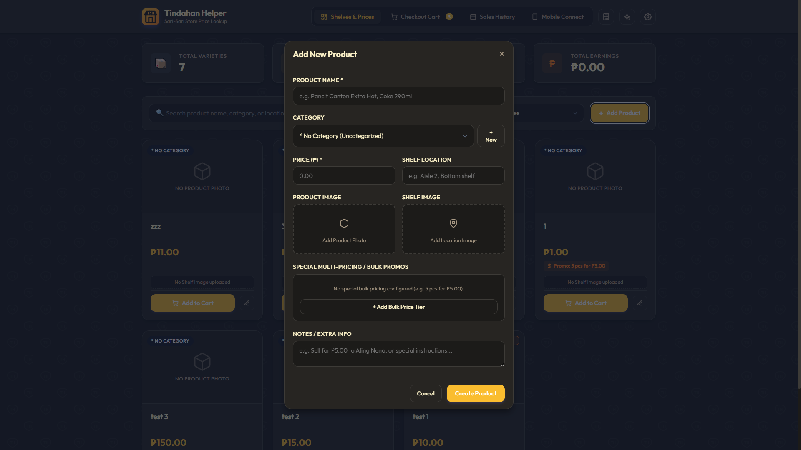
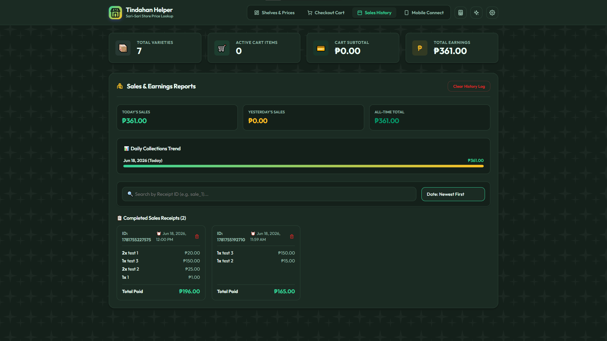
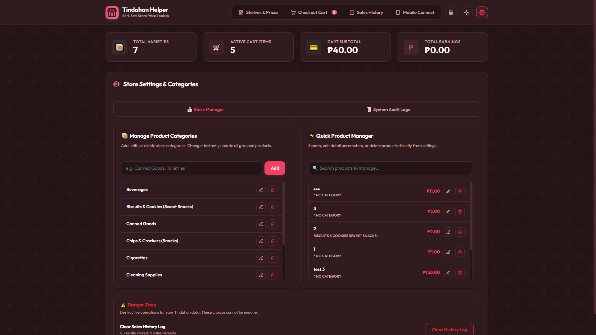
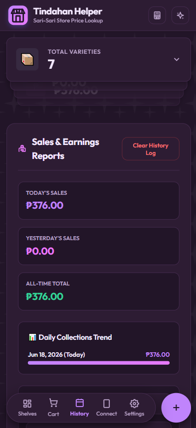

# Tindahan Helper

Tindahan Helper is a Point of Sale (POS) and pricing reference system designed specifically for local convenience stores and small retail shops (like *sari-sari* stores in the Philippines). It provides an intuitive, user-friendly interface to manage product prices, view physical item locations, process sales, and track revenue without requiring an internet connection or complex cloud setups.

## Screenshots

<p align="center">
  
  
</p>
<p align="center">
  
  
</p>
<p align="center">
  
  
</p>

## Why this was built (The Story)

This project was originally built out of personal necessity. When stepping in to temporarily watch the family *sari-sari* store, the hardest parts were memorizing frequently changing prices and finding where items were actually placed in a disorganized setup. 

**Note on Stock Monitoring:** You might notice that this system does **not** track exact inventory quantities. This is intentional! In a typical *sari-sari* store, stock levels are usually just checked visually (you know you're running out when you physically see the shelf is empty). 

Instead of tedious stock counting, this app focuses heavily on what actually matters for someone filling in:
- **Fast Price Lookups:** Easily check and update prices.
- **Location Photos:** Features a dedicated image upload for the *shelf location* so anyone can find a product even if they aren't familiar with the store layout.

## Features

*   **Inventory Management:** Manage products, categories, pricing, and shelf locations. Supports adding product photos and location images.
*   **Point of Sale (POS):** Fast and efficient checkout cart system. Supports custom bulk pricing tiers (e.g., discounted prices for purchasing multiple quantities).
*   **Sales Tracking:** Comprehensive sales history with real-time analytics on daily revenue, cart averages, and transaction volume.
*   **Audit Logging:** Tracks all system events including product creation, updates, deletions, and pricing changes. Supports restoring deleted products or reverting price changes.
*   **Theme Engine:** Multiple built-in color themes and background patterns to customize the visual appearance of the application.
*   **Responsive Design:** Optimized for both desktop and mobile devices, allowing store owners to manage their inventory on the go.
*   **Local Network Access:** Built-in guidance for accessing the system from mobile devices connected to the same local Wi-Fi network.

## Technology Stack

### Frontend
*   React
*   TypeScript
*   Vite
*   Vanilla CSS (Custom design system)

### Backend
*   Node.js
*   Express
*   Multer (File uploads)
*   Local JSON Data Store (No external database required)

## Installation

### Prerequisites
*   Node.js (v16.x or higher recommended)
*   npm or yarn

### Setup

1.  **Clone the repository:**
    ```bash
    git clone https://github.com/yourusername/tindahan-helper.git
    cd tindahan-helper
    ```

2.  **Install dependencies (Windows):**
    Simply double-click the `setup.bat` file in the project root folder. It will automatically install all required packages for both the frontend and backend.

    *(Manual Installation for Mac/Linux or Terminal users):*
    ```bash
    # Install backend dependencies
    cd backend
    npm install
    
    # Install frontend dependencies
    cd ../frontend
    npm install
    ```

## Usage

### Quick Start (Windows)

For Windows users, the easiest way to launch the application is using the provided batch script. It acts as a one-click macro that compiles a highly-optimized **Production Build** of the frontend and serves it through the backend server on port 5000.

1. Double-click the `start.bat` file in the project root.
2. The script will automatically compile the latest frontend changes and start the backend. You can access the app by navigating to `http://localhost:5000` in your web browser.
3. The console will also display instructions for accessing the app from mobile devices on your local Wi-Fi network.

### Development Mode

To run the application in development mode (with hot-reloading for the frontend), you will need to start both the backend server and the frontend development server manually.

1.  **Start the backend server:**
    ```bash
    cd backend
    npm start
    ```
    The backend server will run on `http://localhost:5000`.

2.  **Start the frontend development server:**
    Open a new terminal window or tab:
    ```bash
    cd frontend
    npm run dev
    ```
    The application will be accessible at `http://localhost:5173`.

### Production Build

1.  **Build the frontend:**
    ```bash
    cd frontend
    npm run build
    ```
    This will compile the React application into the `dist` directory.

2.  **Run the production server:**
    The Node.js backend is configured to serve the frontend static files from the `frontend/dist` directory.
    ```bash
    cd backend
    npm start
    ```
    The entire application (frontend and backend) will be accessible at `http://localhost:5000`.

## Architecture overview

The repository is structured as a **monorepo** following a client-server architecture. The frontend is a Single Page Application (SPA) built with React that communicates with the Node.js backend via RESTful APIs.

*   `backend/data/inventory.json`: Acts as the local database, storing products, sales records, categories, and audit logs.
*   `backend/uploads/`: Stores uploaded product and shelf location images.
*   `frontend/src/components/`: Contains modular React components such as `App`, `ProductForm`, `CartPOS`, `SalesHistory`, and `Settings`.

## Roadmap

- [ ] **Migrate to SQLite**: Replace the current JSON file data store with SQLite to improve concurrency, performance at scale, and data safety during unexpected power outages.

## Contributing

1.  Fork the repository.
2.  Create a feature branch (`git checkout -b feature/your-feature-name`).
3.  Commit your changes (`git commit -m 'Add some feature'`).
4.  Push to the branch (`git push origin feature/your-feature-name`).
5.  Open a Pull Request.

## License

This project is licensed under the MIT License. See the [LICENSE](LICENSE) file for details.
